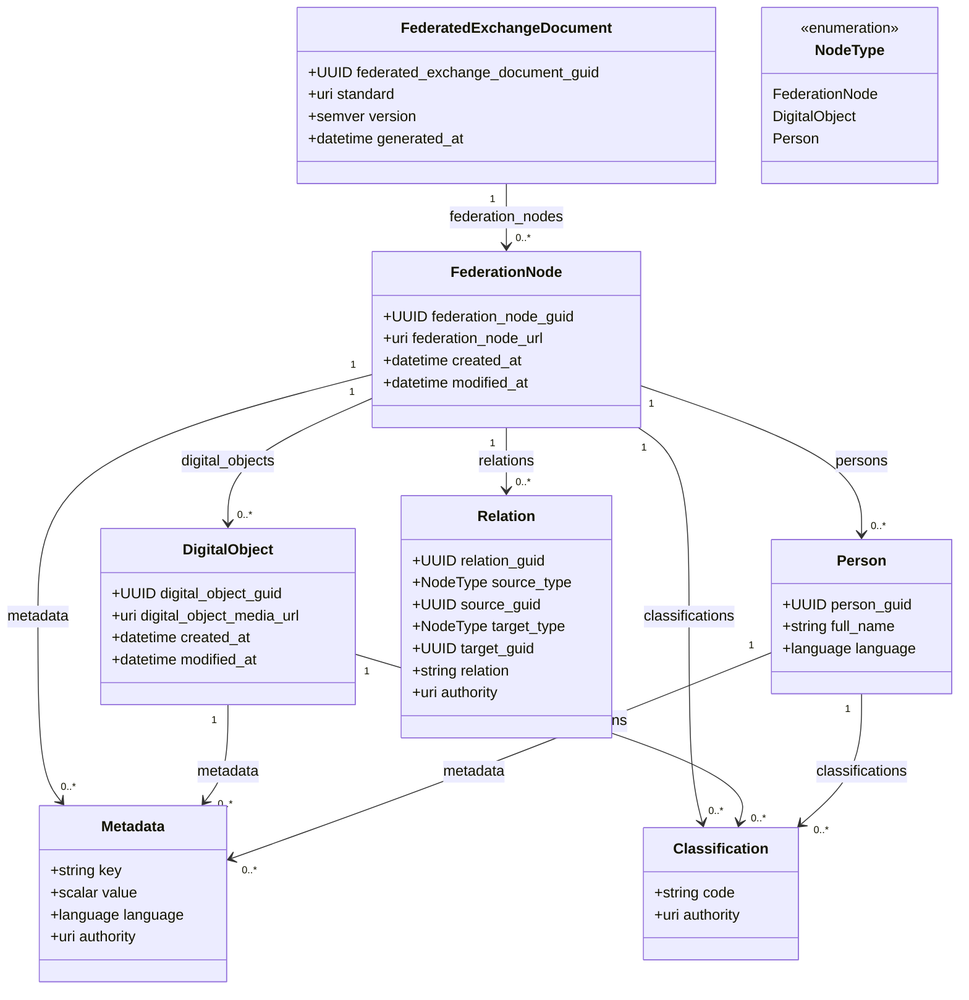

# Federated Exchange Document v0.0.3

```mermaid
classDiagram

class FederatedExchangeDocument {
   +UUID federated_exchange_document_guid
   +uri standard
   +semver version
   +datetime generated_at
}

class FederationNode {
   +UUID federation_node_guid
   +uri federation_node_url
   +datetime created_at
   +datetime modified_at
}

class DigitalObject {
   +UUID digital_object_guid
   +uri digital_object_media_url
   +datetime created_at
   +datetime modified_at
}

class Classification {
   +string code
   +uri authority
}

class Metadata {
   +string key
   +scalar value
   +language language
   +uri authority
}

class Person {
   +UUID person_guid
   +string full_name
   +language language
}

class Relation {
   +UUID relation_guid
   +NodeType source_type
   +UUID source_guid
   +NodeType target_type
   +UUID target_guid
   +string relation
   +uri authority
}

class NodeType {
   <<enumeration>>
   FederationNode
   DigitalObject
   Person
}

FederatedExchangeDocument "1" --> "0..*" FederationNode : federation_nodes

FederationNode "1" --> "0..*" DigitalObject : digital_objects
FederationNode "1" --> "0..*" Person : persons
FederationNode "1" --> "0..*" Metadata : metadata
FederationNode "1" --> "0..*" Classification : classifications
FederationNode "1" --> "0..*" Relation : relations

DigitalObject "1" --> "0..*" Metadata : metadata
DigitalObject "1" --> "0..*" Classification : classifications

Person "1" --> "0..*" Metadata : metadata
Person "1" --> "0..*" Classification : classifications
```
