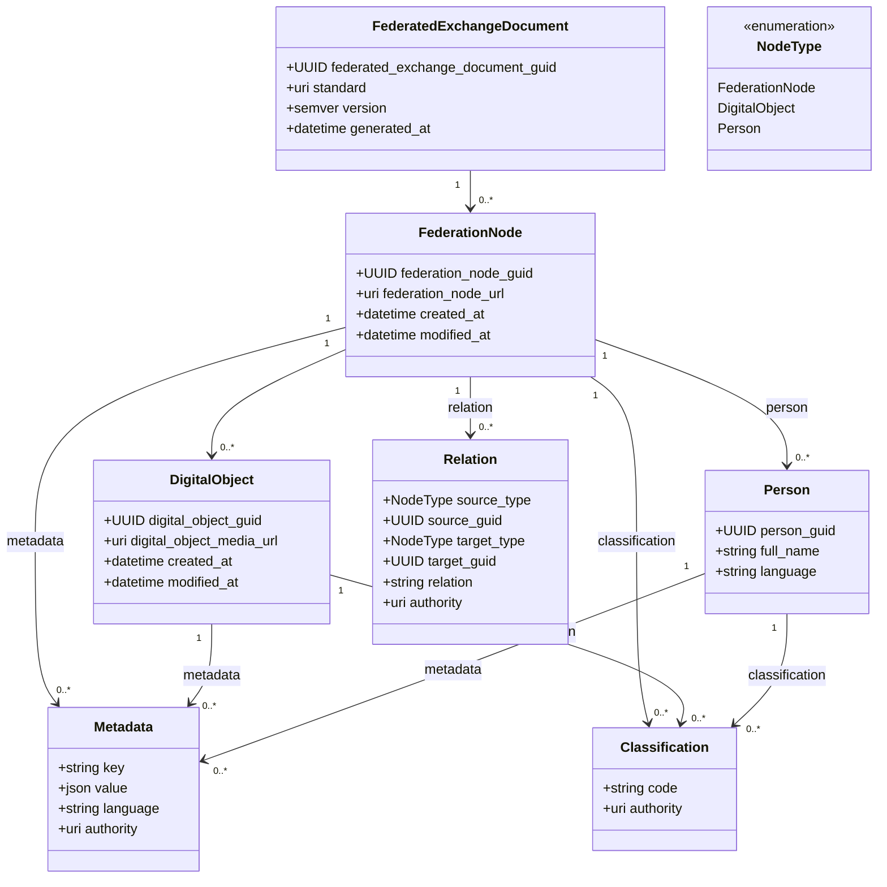

# Federated Exchange Document v0.0.3
* string - UTF-8 only
* datetime - ISO8601 UTC timestamps
* uri - absolute URI only
* Поля с названием language - BCP47 lowercase normalization
* omit null fields
* All UUID - globally unique (UUID v4), immutable, lowercase
* Each FederatedExchangeDocument represents an immutable export snapshot generated at generated_at.
* FederatedExchangeDocument.version: semver (MAJOR.MINOR.PATCH)
* FederatedExchangeDocument.standard = "https://github.com/herzen-vis-lab/heritage-data-exchange/blob/main/docs/federated-exchange-protocol.md"
* Classification определяется на уровне FederationNode и переиспользуется DigitalObject и Person
* Classification дедуплицируется через совпадение code + authority — не через Relation. authority должен быть глобально известным uri (например https://vocab.getty.edu/aat/). key должен соответствовать термину из словаря указанного в authority.
* Metadata entries attached to the same parent entity. MUST be unique by (key, language, authority). Metadata.value MUST be a JSON scalar:
- string
- number
- boolean

