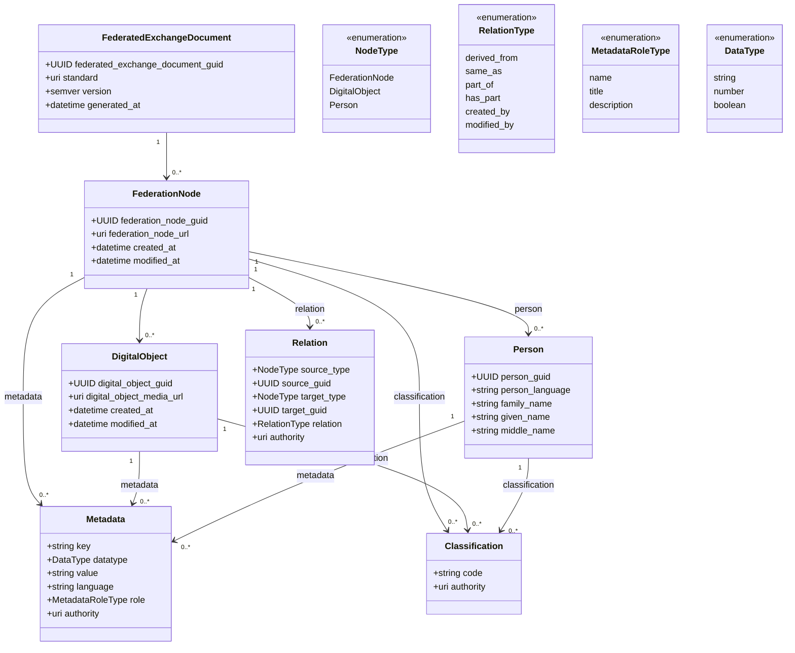

# Federated Exchange Document v0.0.3
%%: UUID - globally unique (UUID v4), immutable

%%: FederatedExchangeDocument.version: semver (MAJOR.MINOR.PATCH)

%%: FederatedExchangeDocument.standard = "https://github.com/herzen-vis-lab/heritage-data-exchange/blob/main/docs/federated-exchange-protocol.md"

%%: MetadataRoleType - каждая конкретная FederationNode может расширять данный справочник

%%: Classification определяется на уровне FederationNode и переиспользуется DigitalObject и Person

%%: Classification дедуплицируется через совпадение code + authority — не через Relation. 

%%: authority должен быть глобально известным URI (например https://vocab.getty.edu/aat/).

%%: key должен соответствовать термину из словаря указанного в authority.

