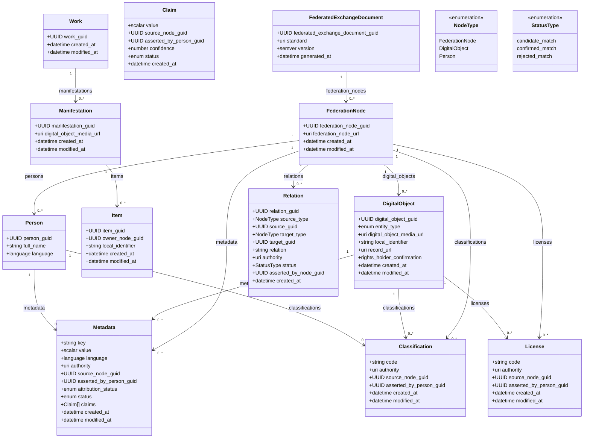

# Federated Exchange Document v0.0.8

Модель данных и правила протокола федеративного обмена объектами цифрового
культурного наследия в слабосвязанной сети независимых организаций.

Машиночитаемые артефакты:

- [JSON Schema модели данных](../schema/federated-exchange-document.schema.json)
- [JSON Schema конверта обмена](../schema/exchange-envelope.schema.json)
- [Правила протокола](federated-exchange-document.rules.dsl)
- [Пример обмена А/Б](../examples/README.md)

```mermaid
classDiagram

class FederatedExchangeDocument {
   +UUID federated_exchange_document_guid
   +uri standard
   +semver version
   +datetime generated_at
}

class FederationNode {
   +UUID federation_node_guid
   +uri federation_node_url
   +datetime created_at
   +datetime modified_at
}

class DigitalObject {
   +UUID digital_object_guid
   +enum entity_type
   +uri digital_object_media_url
   +string local_identifier
   +uri record_url
   +rights_holder_confirmation
   +datetime created_at
   +datetime modified_at
}

class Classification {
   +string code
   +uri authority
   +UUID source_node_guid
   +UUID asserted_by_person_guid
   +datetime created_at
   +datetime modified_at
}

class License {
   +string code
   +uri authority
   +UUID source_node_guid
   +UUID asserted_by_person_guid
   +datetime created_at
   +datetime modified_at
}

class Claim {
   +scalar value
   +UUID source_node_guid
   +UUID asserted_by_person_guid
   +number confidence
   +enum status
   +datetime created_at
}

class Work {
   +UUID work_guid
   +datetime created_at
   +datetime modified_at
}

class Manifestation {
   +UUID manifestation_guid
   +uri digital_object_media_url
   +datetime created_at
   +datetime modified_at
}

class Item {
   +UUID item_guid
   +UUID owner_node_guid
   +string local_identifier
   +datetime created_at
   +datetime modified_at
}

class Metadata {
   +string key
   +scalar value
   +language language
   +uri authority
   +UUID source_node_guid
   +UUID asserted_by_person_guid
   +enum attribution_status
   +enum status
   +Claim[] claims
   +datetime created_at
   +datetime modified_at
}

class Person {
   +UUID person_guid
   +string full_name
   +language language
}

class Relation {
   +UUID relation_guid
   +NodeType source_type
   +UUID source_guid
   +NodeType target_type
   +UUID target_guid
   +string relation
   +uri authority
   +StatusType status
   +UUID asserted_by_node_guid
   +datetime created_at
}

class NodeType {
   <<enumeration>>
   FederationNode
   DigitalObject
   Person
}

class StatusType {
   <<enumeration>>
   candidate_match
   confirmed_match
   rejected_match
}

FederatedExchangeDocument "1" --> "0..*" FederationNode : federation_nodes

FederationNode "1" --> "0..*" DigitalObject : digital_objects
FederationNode "1" --> "0..*" Person : persons
FederationNode "1" --> "0..*" Metadata : metadata
FederationNode "1" --> "0..*" Classification : classifications
FederationNode "1" --> "0..*" License : licenses
FederationNode "1" --> "0..*" Relation : relations

DigitalObject "1" --> "0..*" Metadata : metadata
DigitalObject "1" --> "0..*" Classification : classifications
DigitalObject "1" --> "0..*" License : licenses

Work "1" --> "0..*" Manifestation : manifestations
Manifestation "1" --> "0..*" Item : items

Person "1" --> "0..*" Metadata : metadata
Person "1" --> "0..*" Classification : classifications
```

Примечание (v0.0.8): провенанс атрибуции — каждый атрибут (`Metadata`) и
классификация могут указывать эксперта-атрибутора (`asserted_by_person_guid`,
ссылка на `Person`) и уровень верификации (`attribution_status`:
`unverified` / `expert_verified` / `authoritative`). Эксперты узлов
регистрируются и проходят верификацию уровня знаний; полная спецификация
полей — в [JSON Schema](../schema/federated-exchange-document.schema.json).

Персоны принадлежат узлам: в модели `Person` вложен в `FederationNode`
(каждый узел ведёт реестр своих экспертов), в конверте `persons` — контекст
конкретного обмена (набор персон, на которые ссылаются карточки), а не
глобальный реестр. Идентичность персоны — пара
`(federation_node_guid, person_guid)`; `asserted_by_person_guid` разрешается
в связке с `source_node_guid` атрибута.

Лицензии (`License`) задаются по аналогии с классификацией: код + `authority`.
`authority` может ссылаться на любой авторитетный источник лицензий (SPDX,
Creative Commons, реестры организаций); некоммерческая организация (НКО)
— один из возможных авторитетных источников, а не управляющий орган сети.
Поле `is_enabled_for_ai_using` в `Metadata` разрешает использование значения
атрибута в обучающих данных моделей ИИ; отсутствие флага означает запрет
(консервативный дефолт).

Сущности наследия моделируются через `entity_type` карточки (`DigitalObject`,
`Work`, `Manifestation`, `Item`). `Work` — абстрактная сущность: первый
регистратор является первичным источником её атрибутов. `Manifestation` —
реализация `Work` (`work_guid`); `Item` — физический или локальный экземпляр,
принадлежащий узлу-владельцу (`manifestation_guid`, `owner_node_guid`).
Items разных узлов одной Manifestation не считаются дубликатами; дедупликация
выполняется на уровне Work и Manifestation.

Приоритет по времени (первый регистратор) применяется только к идентичности
и владению записью, но не к истинности атрибутов. При расхождении атрибут
хранится как множество заявлений (`Claim`) с провенансом и статусом
(`unresolved` / `canonical` / `rejected`). Каноническое значение выбирается
явным правилом: N≥2 независимых подтверждений, окно оспаривания, fallback
первого регистратора при отсутствии оспаривания. Дедупликация (matching) и
принятие атрибутов (acceptance) — раздельные события протокола. Регистрация
работ, созданных третьими лицами, требует `rights_holder_confirmation`.

## Транспортный конверт (Exchange Envelope)

Модель данных выше описывает состояние федерации (снимок). Обмен между узлами
асинхронный и выполняется конвертами `ExchangeEnvelope` — обёрткой над
набором карточек объектов (`objects`), связей (`relations`) и персон
(`persons`). Конверт несёт метаданные протокола: версию и идентификаторы
узлов-отправителя и получателя.

Тип конверта один — `publish` (публикация состояния объекта). Режим
определяется полем `receiver_node_guid`:

| Режим | receiver_node_guid | Содержимое карточки |
|---|---|---|
| **Broadcast** | отсутствует | Полный снимок объекта: все атрибуты со всеми `source_node_guid`, известные отправителю; доставляется подписчикам группы классификатора |
| **Таргетированный (возврат вклада)** | заполнен (`= X`) | Только вклад получателя: атрибуты с `source_node_guid == X`, связи с участием X, минимальный контекст объекта (guid, media, local_identifier, record_url) |

Дедупликация и обогащение — локальные операции узлов: узел проверяет
полученные карточки на дубликаты в своей БД, добавляет атрибуты
(`source_node_guid` — свой) и публикует связи (`candidate_match` /
`confirmed_match` / `rejected_match`) теми же конвертами `publish`.
Получатель выполняет merge по провенансу: атрибуты с разными
`source_node_guid` не затирают друг друга. Мастер-запись не выделяется:
у каждого узла сохраняется собственная карточка объекта, карточки
связываются (`same_as`) и взаимно обогащаются.

Транспортный слой и механизм подписки на группы — предмет реализации и
отдельной публикации; целостность и подлинность конверта обеспечиваются
транспортным слоем (подпись, TLS).

Сценарий обмена между организациями А и Б (оцифровка → публикация →
проверка дубликатов → обогащение → подтверждение и возврат вклада) описан
в [примере](../examples/README.md), правила — в
[`federated-exchange-document.rules.dsl`](federated-exchange-document.rules.dsl).
