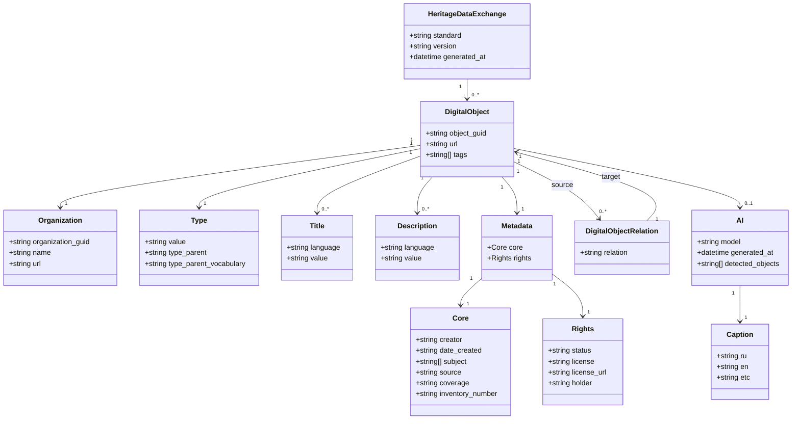

# ru-federated-cultural-ai-exchange.uml v.0.0.1

```mermaid
classDiagram

class HeritageDataExchange{
    +string standard
    +string version
    +datetime generated_at
}

class Organization {
    +string organization_guid
    +string name
    +string url
}

class DigitalObject {
    +string object_guid
    +string url
    +string[] tags
}

class Type {
    +string value
    +string type_parent
    +string type_parent_vocabulary
}

class Title {
    +string language
    +string value
}

class Description {
    +string language
    +string value
}

class Metadata {
    +Core core
    +Rights rights
}

class Core {
    +string creator
    +string date_created
    +string[] subject
    +string source
    +string coverage
    +string inventory_number
}

class Rights {
    +string status
    +string license
    +string license_url
    +string holder
}

class DigitalObjectRelation {
    +string relation
}

class AI {
    +string model
    +datetime generated_at
    +string[] detected_objects
}

class Caption {
    +string ru
    +string en
    +string etc
}

%% Relationships

HeritageDataExchange "1" --> "0..*" DigitalObject
DigitalObject "1" --> "1" Organization
DigitalObject "1" --> "1" Type
DigitalObject "1" --> "1" Metadata
DigitalObject "1" --> "0..*" DigitalObjectRelation : source
DigitalObject "1" --> "0..1" AI
DigitalObject "1" --> "0..*"  Title
DigitalObject "1" --> "0..*"  Description

Metadata "1" --> "1" Core
Metadata "1" --> "1" Rights

DigitalObjectRelation "1" --> "1" DigitalObject : target
AI "1" --> "1" Caption

```
